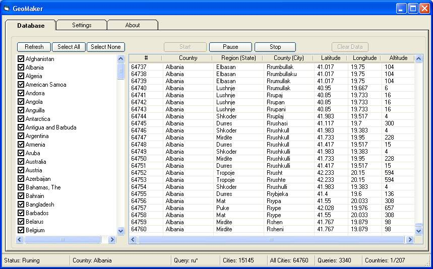



## GeoMaker Ver 2\.0\- World GeoDatabase Maker \- Latitude, Longitude, Altitude for ever city in the world

### Description

Create the GeoDatabase for the entire world. This program create the geographical location Latitude, Longitude, and Altitude (Elevation) for every city, village, region, state, county in the World. The program crawls the data from the website www.heavens-above.com which collect data from US Geological Survey for the USA (and dependencies) and The National Imaging and Mapping Agency for all other countries.Version 2.0 fixes the USA database issues and other fixes.
 
### More Info
 

             |
---                |---
**Submitted On**   |2009-09-09 23:19:52
**By**             |[Ahmed Amin Elsheshtawy](https://github.com/Planet-Source-Code/PSCIndex/blob/master/ByAuthor/ahmed-amin-elsheshtawy.md)
**Level**          |Intermediate
**User Rating**    |4.7 (14 globes from 3 users)
**Compatibility**  |VB 3\.0, VB 4\.0 \(16\-bit\), VB 4\.0 \(32\-bit\), VB 5\.0, VB 6\.0, VB Script, VBA MS Excel
**Category**       |[Complete Applications](https://github.com/Planet-Source-Code/PSCIndex/blob/master/ByCategory/complete-applications__1-27.md)
**World**          |[Visual Basic](https://github.com/Planet-Source-Code/PSCIndex/blob/master/ByWorld/visual-basic.md)
**Archive File**   |[GeoMaker\_V2162389112009\.zip](https://github.com/Planet-Source-Code/ahmed-amin-elsheshtawy-geomaker-ver-2-0-world-geodatabase-maker-latitude-longitude-altitud__1-67897/archive/master.zip)

